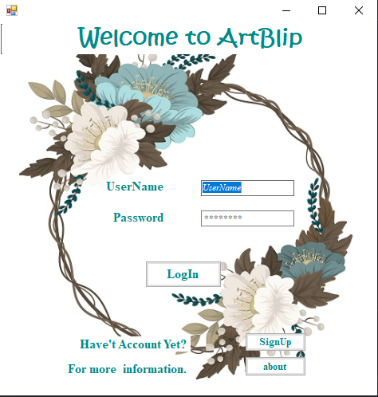
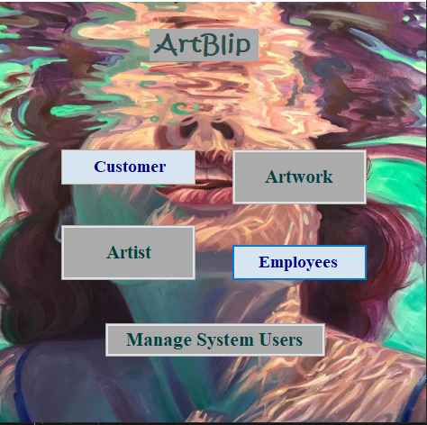
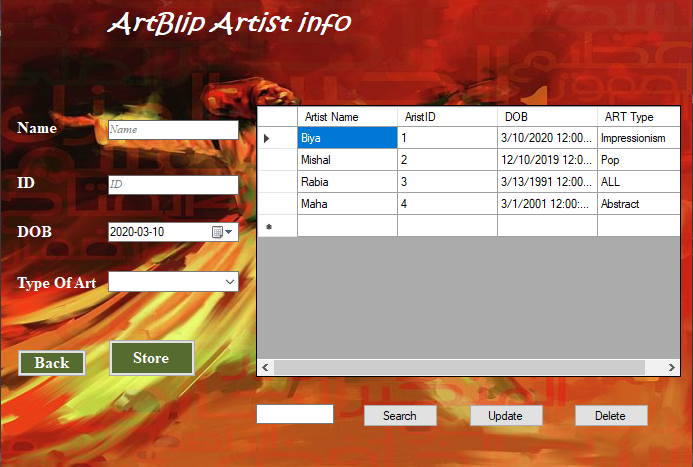

# 🔎🧾 ARTBLIP

## Microsoft .Net Framework

## 🛠 TOOLS
For this project to run you need to have 
##Visual Studio 2017 Community
Install the code editor Visual Studio 2017 Community.

## Microsoft .Net Framework
Install Microsoft .Net Framework.

## Microsoft SQL Server 2014 Management Studio
Install database management system, Microsoft SQL Server 2014 Management Studio.

##  🏗 SETUP

1. Clone the code 
2. Open the project in Visual Studio.
3. Click the start button on tool bar of the Visual Studio to run the project.
#### You will see this screen on the project.

After login or signup you will see the main screen of the project.Further each section have CRUD operation. 

By click on Artwork we will have this.

